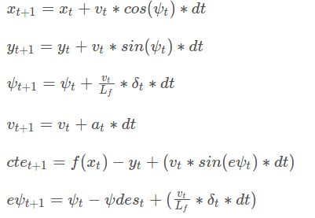

### Model used

In this MPC project, we model the state of vehicle with its location `x` and `y`, its heading `psi` and speed `v`, as well as the cross track error `cte` and heading error `epsi`.

The acutuations to the vehicle are the steering angle `delta` and pedal/brake `a`.

The update equation is the following (taken from the course):



## Choosing timestep length and elapsed duration

I believe we have two goals here:

1. we want to make sure we are able to make fine/precise enough trajectory that is able to make the vehicle stay in lane even in hard turns. 
2. We don't want to use too much computation because each optimization has to be done in real time.

So here's how I choose my `N` and `dt`:

- We need to make sure that `N` * `dt` can give long enough trajectory, but not too long because the far away trajectory won't really affect the actuations of the current frame very much and we are re-calculating everything at each frame anyway.
- We need to make sure `dt` is not too big so we can have a fine trajectory but not too small either so we can have a reasonable small `N`.

In the end, I use `N` = 20, and `dt` = 0.1. I found that this will give trajectory about 30 meters long and the density of the trajectory points is large enough so the vehicle can handle sharp turns even after at a high speed (90 mph).

### Polynomial fit and preprocessing
Since most road correctly built can be modeled with ploynomial functions with order of <= 3, we just fit the received waypoints with a <=3 order polynomial function using minimium using least squares method(implemented with QR decomposition).

We use car coordinates, instead of world coordinates, for polyfits and later optimizations. We transform the waypoints from world coordinates into car coordinates (front is x, left is y) so the polyfit result won't be something like "x = 3" (where the coefficent is infinite large) because the polyfit result will almost certainly face to the front along the x axis in car's coordinate and the slope won't be very large. Also (fortunately), our emulator receives trajectory using car's coordinates, so that's another reason to use car coordinates.

### Deal with latency

There is a latency between we receive observation of the vehicle state and giving out actuations, so we have to calculate actuations for a moment in the future. To handle this, I predict the vehicle's position 100ms into the future:

```
double pred_px = px + v * cos(psi) * dt;
double pred_py = py + v * sin(psi) * dt;
```

Also I assume the heading and velocity doesn't change during this 100ms.

And then I start the optimization problem with the predicted location.